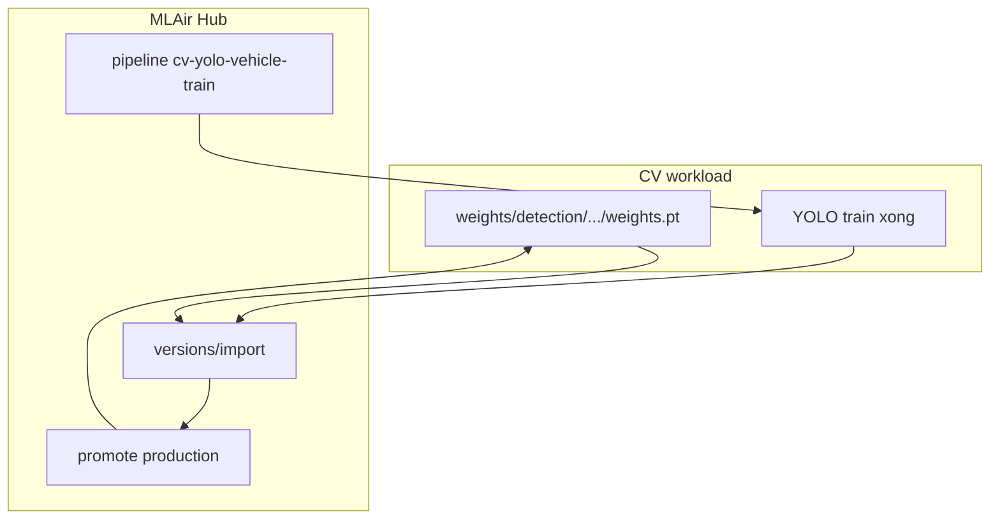

# CV workload ↔ MLAir (theo mô hình Vet-AI / DACN)

## Một câu

**Inference:** luôn đọc `weights/detection/{model}/{version}/weights.pt` trên disk (volume `./weights`).  
**MLAir:** registry + Hub UI + pipeline train — bản sao governance, **không** là runtime inference.

---

## 1) Nơi lưu model thật (source of truth)

| Lớp | Vị trí | Nội dung |
|-----|--------|----------|
| **CV disk** | `CV_DETECTION_MODEL_DIR` → `weights/detection` | **`base/` + `production/`** = bản đang chạy (mirror Hub production). **`v1/`, `v2/`…** = archive mỗi lần train/import (không xóa khi rollback). **`pretrained/`** = COCO gốc. |
| **Cấu trúc job** | spec `yolov8n/base` | Luôn trỏ slot **active**; UI label hiển thị `MLAir production vN` từ control plane. |
| **Cache (optional)** | `weights/registry/{model_id}/vN.pt` | Mirror để resolve `registry:{uuid}` nếu cần |

Streamlit / detection worker → `resolve_local_weights()` → **chỉ disk**.

---

## 2) MLAir lưu gì

- `ML_AIR_DEFAULT_MODEL_ARTIFACT_ROOT` → `file:///mlair/artifacts/models`
- Volume Docker: `ml_air_model_artifacts`
- Import: `POST .../models/{model_id}/versions/import` (multipart `weights.pt`)
- Version Hub: số nguyên `1`, `2`, … — **không** trùng tên folder disk `base` / `v20260512_*`

---

## 3) Cầu nối: `mlair-sync.json` (học Vet-AI)

Mỗi thư mục version có thể có:

`weights/detection/yolov8n/base/mlair-sync.json`

```json
{
  "cv_disk_version": "base",
  "cv_model": "yolov8n",
  "cv_spec": "yolov8n/base",
  "sha256": "...",
  "mlair": {
    "model_id": "uuid",
    "version": 1,
    "version_id": "uuid",
    "artifact_uri": "file:///mlair/artifacts/models/.../v1",
    "stage": "production"
  }
}
```

Bản copy trong `metadata.json` → key `cv_mlair_sync` (optional).

Env: `CV_MLAIR_DISK_SYNC_MODE=metadata` (mặc định). Legacy: `state` chỉ dùng `artifacts/.mlair_model_sync_state.json`.

---

## 4) Luồng đồng bộ



### A) Registry core (startup + mỗi ~120s)

Hàm: `sync_mlair_registry_core()` — `mlair_adapter/registry_sync.py`

- **Push** canonical checkpoint mỗi tên model (`base` → Hub import)
- **Production pull** (mặc định `CV_MLAIR_SYNC_PRODUCTION_FROM_HUB=1`): nếu Hub `production_version` ≠ local `base/`, copy bản Hub chọn vào `base/` + `production/` + `v{N}/` — **không** tự chọn `vN` cao nhất trên disk
- `sync-full` (bootstrap): chỉ push; pull production đầy đủ chỉ khi `CV_MLAIR_MIRROR_REGISTRY_TO_LOCAL=1`
- Pipeline bootstrap + `PUT .../pipeline-mapping` (khi startup)
- Chỉ import folder **canonical** trừ khi `CV_MLAIR_DISK_IMPORT_ALL_VERSIONS=1`

Gọi tự động: `start_registry_sync_background()` trong `backend/main.py` lifespan.

**Model mới không chắc tốt hơn model cũ:** train → import `staging` → gate; chỉ promote khi pass. Rollback: trên Hub **promote lại v1** (hoặc version cũ) → webhook/resync ghi đè `base/`; `v2/` vẫn nằm trên disk để so sánh / train tiếp.

### B) Sau train

- MLAir HTTP pipeline → `POST /api/v1/mlair/train/execute`
- `ModelSyncService.sync_after_training()` → pull production về `base`/`production` + ghi `mlair-sync.json`

### C) Hub promote → Vehicle Detection (hai chiều)

Khi trên **MLAir Hub** promote version lên `production`:

1. MLAir gọi webhook `POST http://cv-api:8000/api/v1/mlair/promote-webhook` (env trên `ml-air-api`).
2. CV copy artifact production vào `weights/detection/{model}/base/weights.pt` và `production/weights.pt`.
3. Streamlit chọn `yolov8n (MLAir vN)` → job spec `yolov8n/base` → inference dùng file vừa cập nhật.

Nếu webhook lỗi, **registry resync ~120s** vẫn pull khi `production_version` trên Hub khác bản local.

Env:

```bash
MLAIR_MODEL_PROMOTE_WEBHOOK_URL=http://cv-api:8000/api/v1/mlair/promote-webhook
MLAIR_MODEL_PROMOTE_WEBHOOK_BEARER_TOKEN=admin-token   # = CV_MLAIR_PROMOTE_WEBHOOK_TOKEN
CV_MLAIR_SYNC_ON_HUB_PROMOTE=1
```

### D) Post compose (host)

`./scripts/post_stack_bootstrap.sh` — chown volume + `sync-full?force=1` + pipeline.

---

## 5) So với Vet-AI

| Vet-AI | CV workload |
|--------|-------------|
| `model.pkl` | `weights.pt` |
| `VETAI_MODELS_ROOT` | `weights/detection` |
| `mlair-sync.json` | Cùng pattern |
| `_sync_mlair_project_registry_core` | `sync_mlair_registry_core` |
| `MLAIR_REGISTRY_RESYNC_SECONDS=120` | `CV_MLAIR_REGISTRY_RESYNC_SECONDS` (default 120) |
| Clinic projects | Một project `default_project`, nhiều model logical (`yolov8n`, …) |
| Promote webhook hai chiều | **MLAir → CV** `POST /api/v1/mlair/promote-webhook` (Hub promote → `weights/.../base`) |

---

## 6) Env chính

```bash
CV_MLAIR_AUTO_SYNC_MODELS=1
CV_MLAIR_REGISTRY_SYNC_AT_STARTUP=1
CV_MLAIR_REGISTRY_RESYNC_SECONDS=120
CV_MLAIR_DISK_SYNC_MODE=metadata
CV_MLAIR_DISK_IMPORT_ALL_VERSIONS=0
CV_MLAIR_BOOTSTRAP_PIPELINE=1
```

API tay:

```bash
curl -X POST http://localhost:8000/api/v1/registry/sync-core?force=1
curl -X POST http://localhost:8000/api/v1/registry/models/sync-full?force=1
```

---

## 7) Dataset ≠ model sync

Ingest frame → MLAir **dataset** (`cv-traffic-frames`) là luồng khác; không thay `versions/import` model.
